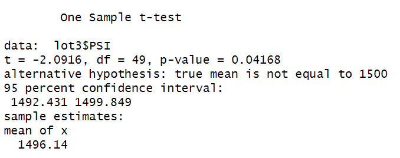

# MechaCar_Statistical_Analysis
## Overview
AutosRUs’ newest prototype, the MechCar, is suffering from production troubles that are blocking the manufacturing team’s progress. AutosRUs’ upper management has called on the data analytics team to review the production data for insights that may help the manufacturing team.

## Purpose
Perform multiple linear regression analysis to identify which variables in the dataset predict the MPG of MechCar prototypes. Collect summary statistics on the pounds per square in (PSI) of the suspension coils from the manufacturing lots. Run t-tests to determine if the manufacturing lots are statistically different from the mean population.

## Linear Regression to Predict MPG
The MechaCar prototypes were produced using multiple design specifications to identify ideal vehicle performance. Multiple metrics, such as vehicle length, vehicle weight, spoiler angle, drivetrain, and ground clearance, were collected for each vehicle. A linear regression model has been created that predicts the mpg of MechaCar prototypes using these variables.

### Linear Regression

### Summary of Linear Regression

The variables/coefficients that provided a non-random amount of variance to the mpg values in the dataset are:
-	Vehicle weight
-	Vehicle angle
-	AWD

The p-value of our linear regression analysis is 5.35e-11, which is much smaller than our assumed significance of level of 0.05%. Therefore, we can state that there is sufficient evidence to reject our null hypothesis, which means that the slope of our linear model is not zero.
From our linear regression model, the r-squared value is 0.71. Which means that roughly 71% of our predictions will be correct. 

## Summary Statistics on Suspension Coils
The weight capacities of multiple suspension coils were tested to determine if the manufacturing process is consistent across production lots. We have taken the suspension coil’s PSI continuous variable across all manufacturing lots. The variance for all manufacturing lots in total is 62, which is less than 100 and within the design specifications for the suspension coils. 

Lot 1 has a variance of 1 and Lot 2 has a variance of 7, which means they are both also operating within the design specifications of not exceeding 100 pounds per square inch. However, Lot 3 is operating with a variance of 170, which is above the design specifications.  

## T-Test on Suspension Coils
T-tests were performed to determine if all manufacturing lots and each lot individually are statistically different from the population mean of 1,500 pounds per square inch.

### T-Test for all Lots
The p-value for all lots is 0.06028 < 0.05, making it statistically different from the population mean. 

### T-Test for Lot 1
The p-value for Lot 1 is 1 > 0.05, making it not statistically significant from the population mean.

### T-Test for Lot 2
The p-value for Lot 2 is 0.6072 > 0.05, making it not statistically significant from the population mean.

### T-Test for Lot 3
The p-value for Lot 3 is 0.04168 > 0.05, making it not statistically significant from the population mean.

## Study Design: MechCar vs Competition
When comparing how the MechaCar performs against the competition, there are two metrics that would be of interest to a consumers. Cost and safety rating are important to a target audience of parents. Our alternative hypotheses is that the MechaCar will outperform the competition when it comes to cost, highway fuel efficiency, and safety rating. Our null hypothesis is that there is no significant difference between the MechaCar and it competitors. Using the analysis of variance (ANOVA) test, we can compare the means across more than two samples or groups. With this statistical test we test our hypothesis to see if the means of all groups are equal or the least one of the means is different from all other groups. The following test requires our dependent value is numerical and continuos and the independent variables be categorical. In this case, our independent values would be the MechaCar and at least 6 other make and models of cars. The dependent variables would be cost and safety ratings. We will need approximately 50 samples per car model to predict an accurate average per model.

